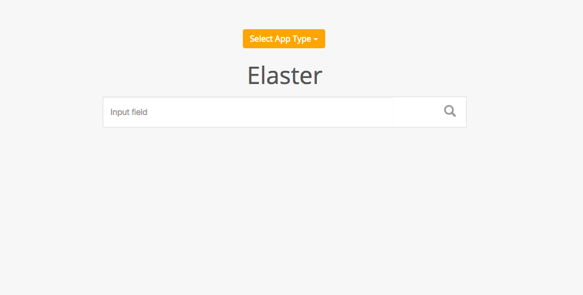
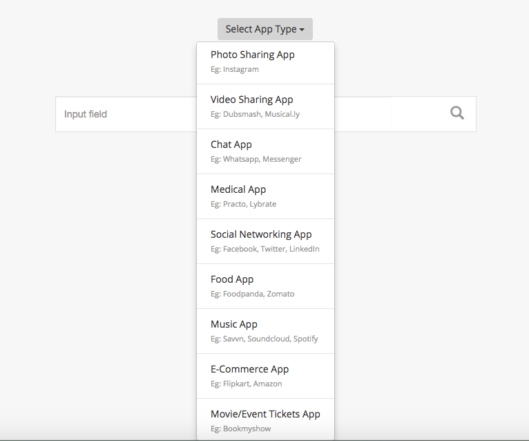

elaster
========

An in-app full-text Search Engine using Elasticsearch (a document store search engine based on Lucene), tornado as web server, sockjs in client(browser) side javascript library, sockjs-tornado as sockjs implementation on server side and elasticsearch-py as elasticsearch python client library.

**NOTE :** Still in developement. Not ready for release. Info added prior just for record purpose.

**NOTE :** Meanwhile, you can check the *Example - Webapp* images and static codes for an overview. 

Documentation
--------------

**Link :** http://elaster.readthedocs.io/en/latest/

Project Home Page
--------------------

**Link :** https://pypi.python.org/pypi/elaster

Example - Webapp
-----------------

* **Welcome Page**

* **Select app type**

Overview
---------

elaster is an in-app full-text Search Engine based on Elasticsearch which can be set up to search your app, website, etc. for any text.

All you have to do is add data to the index, just the data files, all mappings, indexing, settings are taken care by the elaster server.
You can start using the server right away without knowing anything about elasticsearch.

Even the cluster, nodes, etc. are taken care of.

If you want more power and control, change the configuration file at ``/usr/local/etc/elasticsearch/elasticsearch.yml``.

It uses the `Elasticsearch <https://www.elastic.co/products/elasticsearch>`_  to implement the real time full text search functionality. **Elasticsearch** is a search server based on `Lucene <http://lucene.apache.org/>`_. It provides a distributed, multitenant-capable full-text search engine with an HTTP web interface and schema-free JSON documents. Elasticsearch is developed in Java and is released as open source under the terms of the Apache License. Elasticsearch is the most popular enterprise search engine followed by `Apache Solr <https://en.wikipedia.org/wiki/Apache_Solr>`_, also based on Lucene.

A website example is given as builtin. For the website , the connection is created using the `sockjs <https://github.com/sockjs/sockjs-client>`_ protocol. **SockJS** is implemented in many languages, primarily in Javascript to talk to the servers in real time, which tries to create a duplex bi-directional connection between the **Client(browser)** and the **Server**. Ther server should also implement the **sockjs** protocol. Thus using the  `sockjs-tornado <https://github.com/MrJoes/sockjs-tornado>`_ library which exposes the **sockjs** protocol in `Tornado <http://www.tornadoweb.org/>`_ server.

It first tries to create a `Websocket <https://en.wikipedia.org/wiki/WebSocket>`_ connection, and if it fails then it fallbacks to other transport mechanisms, such as **Ajax**, **long polling**, etc. After the connection is established, the tornado server **(sockjs-tornado)** connects to **Elasticsearch** via using the **Elasticsearch Python Client Library**, `elasticsearch-py <https://pypi.python.org/pypi/elasticsearch>`_.

Thus the connection is ``web-browser`` to ``tornado`` to ``elasticsearch`` and vice versa.

For any other **app (Android, iOS)**, use any android, iOS client library to connect to the elaster server. This software provides the website example builtin. Using command line ``elaster --example=webapp``, you start the elaster website example. But to use it in your person app(Anroid, iOS) or web app, use elaster as a general server.

Technical Specs
----------------

:sockjs-client (optional): Advanced Websocket Javascript Client used in **webapp example**
:Tornado: Async Python Web Library + Web Server
:sockjs-tornado: SockJS websocket server implementation for Tornado
:Elasticsearch: A document store search engine based on Lucene
:elasticsearch-py: Low-level elasticsearch python client

Features
---------

* Search Engine
* in-app (Androi, iOS, website)
* Use as a standalone server or as a python library
* Suggestion based search 
* Autocomplete based search
* Add/Index your own dataset in json files

Installation
------------

Prerequisites
~~~~~~~~~~~~~

1. python 2.7+
2. tornado
3. sockjs-tornado 
4. sockjs-client (optional, just for example webapp)
5. elasticsearch-py (python low-level client library for Elasticsearch)
6. Elasticsearch (The search-engine)

Install
~~~~~~~
::

        $ pip install elaster

If above dependencies do not get installed by the above command, then use the below steps to install them one by one.

 **Step 1 - Install pip**

 Follow the below methods for installing pip. One of them may help you to install pip in your system.

 * **Method 1 -**  https://pip.pypa.io/en/stable/installing/

 * **Method 2 -** http://ask.xmodulo.com/install-pip-linux.html

 * **Method 3 -** If you installed python on MAC OS X via ``brew install python``, then **pip** is already installed along with python.

 **Step 2 - Install tornado**
 ::

         $ pip install tornado

 **Step 3 - Install sockjs-tornado**
 ::

         $ pip install sockjs-tornado

 **Step 4 - Install elasticsearch-py**
 ::

         $ pip install elasticsearch

 **Step 5 - Install Elasticsearch**
 
 * *For* ``Mac`` *Users*
 
   1. Install Java 8 (if not instlled already)
   ::

          # Tap Caskroom to install java from caskroom
          $ brew tap caskroom/cask 

          # Install brew-cask to use brew cask command (new homebrew doesn't need this, hence you can use brew cask just by tapping Caskroom)
          $ brew install brew-cask

          # Install java
          $ brew cask install java

   2. Brew Install Mosquitto
   ::

         $ brew install elasticsearch

   3. Configure elasticsearch, by modifying the file at ``/usr/local/etc/elasticsearch/elasticsearch.yml``.

 * *For* ``Ubuntu/Linux`` *Users*

   1. Follow this link, `here <https://www.elastic.co/guide/en/elasticsearch/reference/current/setup.html>`_.

   

   2. Also, you can follow this link, `here <https://www.digitalocean.com/community/tutorials/how-to-install-and-configure-elasticsearch-on-ubuntu-14-04>`_.
   

   4. Configure elasticsearch, by modifying the file at ``/usr/local/etc/elasticsearch/elasticsearch.yml``.

Usage
-----

After having installed elaster, just run the following commands to use it:

* **Elasticsearch Server**
  
  1. *For* ``Mac`` *Users*
  ::

        # start normally
        $ elasticsearch
         
        # If you want to run in background
        $ elasticsearch -d 

        # start using brew services (doesn't work with tmux, athough there is a fix, mentioned in one of the pull requests and issues)
        $ brew services start elasticsearch

  2. *For* ``Ubuntu/LInux`` *Users*
  ::

          # Go inside the elasticsearch extracted directory
          $ cd elasticsearch-2.3.0

          # start normally
          $ bin/elasticsearch

          # If you want to run in background
          $ bin/elasticsearch -d 

* **Start elaster Applcation**
  ::

          $ elaster [options]

  - **Options**

    :--port: Port number where the elaster search engine will start
    :--example: Example webapp to play with the server
    :--data-path: Dirctory containing the datasets in json format or the json file path itself.

  - **Example**
    ::

          # Starting the server
          $ elaster --port=9191

          # Starting the server with the example webapp
          $ elaster --port=9191 --example=webapp

          # Starting the server with custom dataset 
          $ elaster --port --data-path=$HOME/project/xyz/data

  **NOTE** Cannot use both --example and --data-path together, for --example, the dataset is automatically decided and indexed by the server itself.        
  
* **Stop elaster**

  Click ``Ctrl+C`` to stop the server.

* **More Details** 

  Please follow the documentation for more usage details. Documentation link is `this <http://elaster.readthedocs.io/en/latest/>`_.

Todo
-----

1. Add Blog post regarding this topic.

